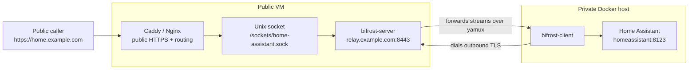

# Bifrost

Bifrost exposes selected TCP services from a private network through a public relay, without opening inbound ports on the private side.

Run `bifrost-server` on a reachable VM, run `bifrost-client` next to the private service, and the client opens the tunnel with an outbound TLS connection. Public callers connect to a listener on the relay side; Bifrost forwards those byte streams through the tunnel to the private target.

Typical use case: Home Assistant, Jellyfin, an admin UI, or another internal TCP service runs behind NAT, DS-Lite, CGNAT, or a firewall. A public VM runs Bifrost and your normal reverse proxy. The private network only needs outbound access to the VM.

**Status:** Bifrost is early and experimental. The transport, hook contract, Docker entrypoint, and config schema are usable for development, demos, and review, but should be treated as pre-1.0.

## What Bifrost Does

Bifrost gives you a small, self-hosted data path:

- `bifrost-server` accepts connector tunnels on a public server.
- `bifrost-client` runs near the private service and dials the server outbound.
- The server creates a listener for the accepted connector, usually a Unix socket consumed by Caddy or Nginx.
- Every public connection to that listener becomes one multiplexed tunnel stream to the private service.

Bifrost forwards byte streams. It does not include HTTP routing, DNS, ACME, SNI routing, account management, billing, dashboards, or application authentication. For HTTP services, put a proxy such as Caddy or Nginx on the public VM and point it at the listener Bifrost creates.

## When To Use It

Use Bifrost when you want:

- outbound-only connectivity from a private network
- a relay you operate yourself
- TLS on the tunnel transport
- explicit admission decisions for each connector
- per-session limits for streams, bandwidth, and idle time
- listener placement controlled by your server-side policy

Bifrost is not a VPN. It exposes selected stream listeners, not an IP network.

Bifrost is not a hosted tunnel product. It has no hosted control plane, account system, billing logic, or managed edge.

Bifrost is not a reverse proxy. Routing, SNI, certificates, and DNS live outside Bifrost.

## How It Works



The connector sends a token during the tunnel handshake. On the server side, Bifrost matches that token against native `clients[]` configuration. If the token is allowed, the server binds the configured listener and applies the configured limits.

For HTTP services, the common shape is:

1. Public Caddy receives `https://home.example.com`.
2. Caddy proxies to `unix//sockets/home-assistant.sock`.
3. Bifrost owns that Unix socket and forwards the stream through the tunnel.
4. The local connector dials `homeassistant:8123` or another private TCP target.

## Quick Start

This quick start shows the real deployment shape: a public server with an existing Caddy reverse proxy and a local Docker environment that already runs a service such as Home Assistant or Jellyfin.

You need:

- A public Linux VM with Docker Compose and Caddy or another reverse proxy.
- A DNS name for the tunnel endpoint, shown below as `relay.example.com`.
- A DNS name for the exposed app, shown below as `home.example.com`.
- TCP port `8443` open on the VM for the Bifrost tunnel.
- TCP ports `80` and `443` handled by your public reverse proxy.
- A local Docker host with outbound access to `relay.example.com:8443`.

The example values used below are:

| Value | Meaning |
| --- | --- |
| `relay.example.com` | DNS name used by the local connector to reach `bifrost-server` |
| `home.example.com` | Public HTTPS hostname served by Caddy |
| `homeassistant:8123` | Private Docker service and port reached by `bifrost-client` |
| `/sockets/home-assistant.sock` | Unix socket created by `bifrost-server` and consumed by Caddy |
| `replace-this-with-a-long-random-token` | Shared connector token in the server and client config |

The snippets assume your public Compose project already has a `caddy` service, your local Compose project already has a `homeassistant` service, and Bifrost files live under `./bifrost/` beside each Compose file.

For Jellyfin, use `jellyfin:8096` as the target address and a matching socket name such as `/sockets/jellyfin.sock`.

### 1. Create Tunnel Credentials On The Public Server

On the public server, from the directory containing your public Compose file:

```bash
mkdir -p bifrost/certs
```

Bifrost uses TLS between `bifrost-client` and `bifrost-server`. For a first deployment, create a self-signed relay certificate whose SAN matches `relay.example.com`:

```bash
openssl req -x509 -newkey rsa:4096 -sha256 -nodes \
  -days 365 \
  -keyout bifrost/certs/server.key \
  -out bifrost/certs/server.crt \
  -subj "/CN=relay.example.com" \
  -addext "subjectAltName=DNS:relay.example.com"
cp bifrost/certs/server.crt bifrost/certs/ca.crt
```

The token admits the connector. The relay certificate secures the tunnel transport. Public HTTPS for `home.example.com` is still handled by Caddy and is separate from this tunnel certificate. For real use, replace the example token with a random value such as the output of `openssl rand -hex 32`.

If the relay certificate is issued by a public CA such as Let's Encrypt, mount that certificate and key on the relay instead. In that case the connector does not need a `ca.crt` mount; the Docker image falls back to the system trust store when `/certs/ca.crt` is absent.

Add the client definition to the server configuration. In Docker-generated config this is supplied through `BIFROST_SERVER_CLIENTS_JSON`. The `listener.path` must match the Unix socket your public reverse proxy will use:

```json
[
  {
    "token": "replace-this-with-a-long-random-token",
    "endpoint_key": "home-assistant",
    "listener": {
      "type": "unix",
      "path": "/sockets/home-assistant.sock",
      "mode": "0600"
    },
    "connection_policy": {
      "mode": "replace_existing",
      "max_parallel": 1
    },
    "limits": {
      "max_streams": 100,
      "max_bandwidth_bps": 25000000,
      "stream_idle_timeout_seconds": 300
    },
    "labels": {
      "service": "home-assistant"
    }
  }
]
```

Keep `bifrost/certs/server.key` only on the public server. The local connector only needs `bifrost/certs/ca.crt` and the same token used in the server `clients[]` config.

### 2. Add Bifrost To The Public Compose Project

Add the relay service to your public Compose file. If your Compose file already has a `volumes:` section, merge the `bifrost_sockets` entry into it.

```yaml
services:
  bifrost-cloud:
    image: ghcr.io/tunely-eu/bifrost:latest
    command: ["server"]
    restart: unless-stopped
    environment:
      BIFROST_SERVER_CLIENTS_JSON: |
        [
          {
            "token": "replace-this-with-a-long-random-token",
            "endpoint_key": "home-assistant",
            "listener": {
              "type": "unix",
              "path": "/sockets/home-assistant.sock",
              "mode": "0600"
            },
            "connection_policy": {"mode": "replace_existing"},
            "limits": {"max_streams": 100}
          }
        ]
    volumes:
      - ./bifrost/certs/server.crt:/certs/server.crt:ro
      - ./bifrost/certs/server.key:/certs/server.key:ro
      - bifrost_sockets:/sockets
    ports:
      - "8443:8443"

volumes:
  bifrost_sockets:
```

Mount the same socket volume into your existing Caddy service. Keep your existing Caddy config, data, and site volumes; add the `/sockets` mount alongside them.

```yaml
services:
  caddy:
    volumes:
      - ./Caddyfile:/etc/caddy/Caddyfile:ro
      - bifrost_sockets:/sockets
```

Add a route to your Caddyfile:

```caddyfile
home.example.com {
	reverse_proxy unix//sockets/home-assistant.sock
}
```

The snippets assume Caddy can read the Unix socket created by `bifrost-cloud`. If your Caddy container runs as a non-root user, configure socket permissions and container users accordingly.

### 3. Add Bifrost To The Local Compose Project

On the local Docker host, place the relay CA certificate at `./bifrost/certs/ca.crt`. For the self-signed certificate above, this is the public `server.crt` copied as `ca.crt`. Do not copy `server.key` to the local side.

Add the connector service to the Compose file that already runs Home Assistant:

```yaml
services:
  bifrost-client:
    image: ghcr.io/tunely-eu/bifrost:latest
    command: ["client"]
    restart: unless-stopped
    depends_on:
      - homeassistant
    environment:
      BIFROST_CLIENT_SERVER_URL: "relay.example.com:8443"
      BIFROST_CLIENT_TLS_SERVER_NAME: "relay.example.com"
      BIFROST_CLIENT_TARGET_ADDRESS: "homeassistant:8123"
      BIFROST_CLIENT_TOKEN: "replace-this-with-a-long-random-token"
    volumes:
      - ./bifrost/certs/ca.crt:/certs/ca.crt:ro
```

For Jellyfin, use `/sockets/jellyfin.sock` in `BIFROST_SERVER_CLIENTS_JSON` and the Caddy route, then change the local target:

```yaml
environment:
  BIFROST_CLIENT_TARGET_ADDRESS: "jellyfin:8096"
```

If the target service is not in the same Compose project, point `BIFROST_CLIENT_TARGET_ADDRESS` at a reachable LAN address instead, for example `192.168.1.20:8123`.

### 4. Test The Public Route

From any machine that can reach the public VM:

```bash
curl -I https://home.example.com
```

You should see the same HTTP response headers you would get from the service inside the private network.

If the request fails, check these points first:

- DNS for `relay.example.com` and `home.example.com` points at the public VM.
- The public VM allows inbound TCP `8443`, `80`, and `443`.
- The local host can open outbound TCP connections to `relay.example.com:8443`.
- For a private or self-signed relay certificate, the local host has `ca.crt`, not `server.key`. For a public-CA relay certificate, no client CA mount is needed.
- `BIFROST_CLIENT_TOKEN` matches the token in the server `clients[]` config.
- The Caddy socket path matches `clients[].listener.path`.

## Configuration Model

The Docker image is the default runtime interface. Use the same image for each runtime role:

- Cloud relay: `command: ["server"]`
- Homelab connector: `command: ["client"]`
- Control command: `command: ["ctl", "..."]`

The Docker entrypoint supports two configuration styles:

- generated config for the default Docker path
- explicit YAML or JSON config files passed with `--config`

The quick start uses generated Docker config on both sides: the relay uses the default container paths, and the connector is configured through Docker environment variables.

### Default Container Paths

Mount these paths when using the generated Docker configuration:

- `/certs/server.crt`: server TLS certificate
- `/certs/server.key`: server TLS private key
- `/certs/ca.crt`: optional client CA certificate for private or self-signed relay certificates
- `/sockets`: allowed Unix socket directory for server-side listeners

The cloud relay listens on `:8443` by default. Generated Docker config requires `BIFROST_SERVER_CLIENTS_JSON`, a JSON array of client definitions.

The full generated Docker config reference and explicit config schema are documented in [Configuration](docs/configuration.md).

## Security And Limitations

- Client-server tunnel transport is always TLS.
- ALPN must be `bifrost/1`.
- The client hello is JSON and size-limited.
- Header names are validated and normalized before admission decisions.
- Header values are generic runtime metadata and are redacted in logs.
- Admission failures, invalid client definitions, invalid listener specs, and missing `endpoint_key` fail closed.
- Streams, sessions, buffers, idle time, and bandwidth have bounded defaults.

TLS protects the tunnel between `bifrost-client` and `bifrost-server`. Bifrost does not automatically apply TLS to the server-side listener or to the client-side local target; it forwards the bytes it receives.

Application authentication stays with your reverse proxy or target service. Public HTTPS for web services stays with Caddy, Nginx, or another proxy on the public VM. See [Security](docs/security.md).

## Library Accept Providers

Bifrost exposes an `AcceptProvider` interface for embedded use. The standalone `bifrost-server` builds a static provider from top-level `clients[]` config.

Product-specific modules can provide their own `AcceptProvider` without shell hooks or external helper processes. This is the intended path for Tunely Control Plane integration.

The library API and config schema are documented in [Configuration](docs/configuration.md).

## Local Development

Build and test locally:

```bash
make test
make entrypoint-test
make build
```

The binaries are written to `bin/`.

Generate starter configs:

```bash
go run ./cmd/bifrostctl config example --server
go run ./cmd/bifrostctl config example --client
```

Validate your own configs:

```bash
go run ./cmd/bifrostctl config validate --server --file path/to/server.yaml
go run ./cmd/bifrostctl config validate --client --file path/to/client.yaml
```

## Documentation

- [Architecture](docs/architecture.md)
- [Protocol](docs/protocol.md)
- [Configuration](docs/configuration.md)
- [Security](docs/security.md)

## Contributing

See [CONTRIBUTING.md](CONTRIBUTING.md) for development setup, review expectations, and pull request guidelines.

Please report suspected vulnerabilities through the process in [SECURITY.md](SECURITY.md).

## License

MIT License. See [LICENSE](LICENSE).
